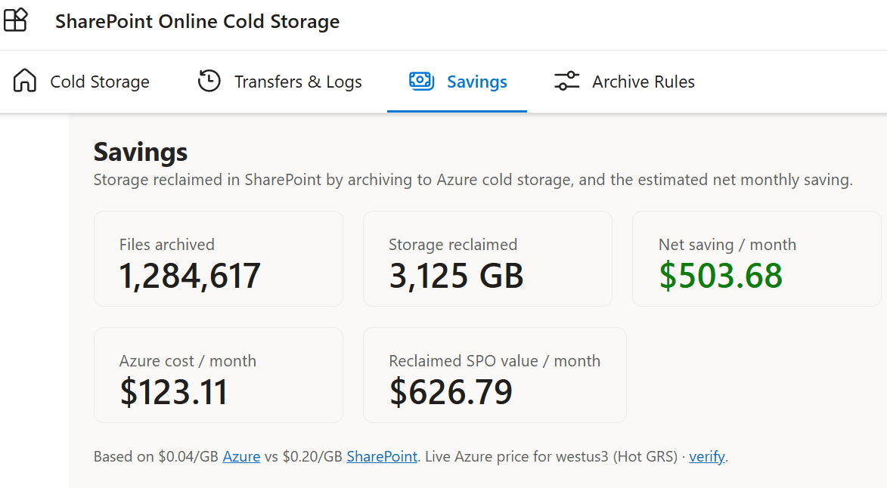
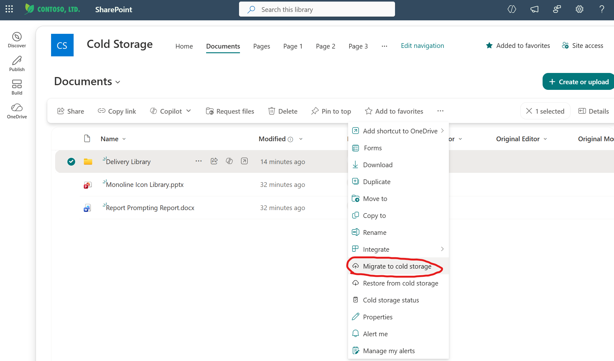
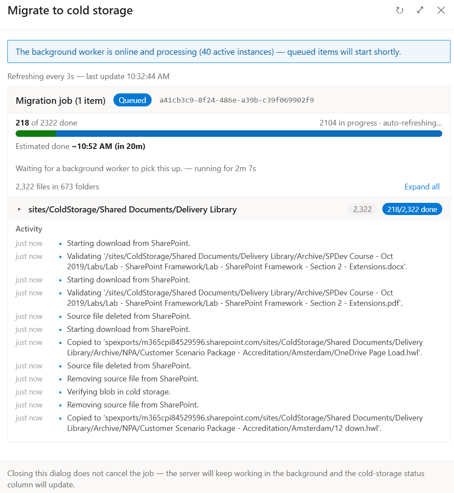
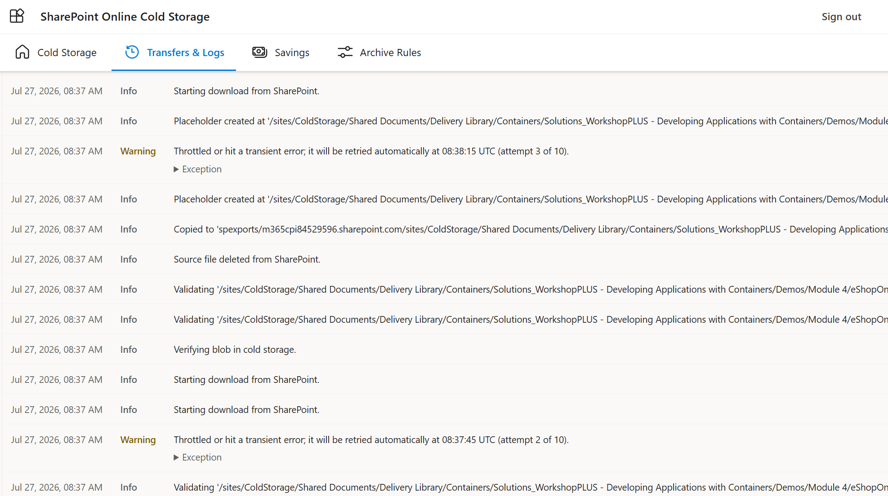
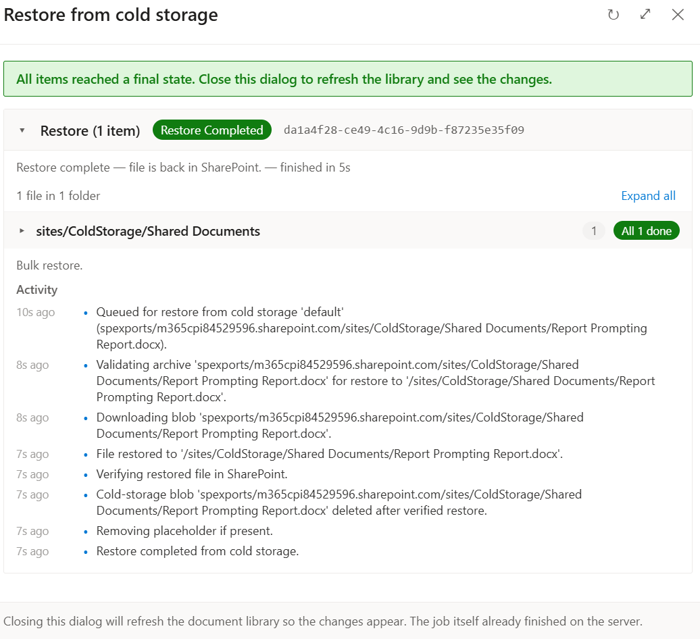

# SharePoint Online Cold Storage

### Stop paying premium prices to store files nobody opens.

SharePoint libraries fill up with files that haven't been touched in years — old
projects, finished deliverables, archived training material. You still pay full
SharePoint price to keep every one of them.

**SPO Cold Storage** moves those inactive files into low-cost Azure storage and leaves
a small link behind in their place. The file looks like it's still there; the bytes now
cost a fraction of what they did. Need it back? Restore it in a click. Nothing is ever
lost, and every move is tracked.

  

<i>Real storage reclaimed, real money saved — shown in your currency at live Azure prices.</i>

---

## Why people love it

💰 **Cut your storage bill.** Inactive files move to storage that can cost a fraction of
the SharePoint price per gigabyte. The savings dashboard shows exactly how much you're
saving each month, in your currency, using live Azure prices.

🛡️ **Your files are never at risk.** An original file is **only** removed after its copy
has been made *and* verified byte-for-byte. If anything goes wrong at any step, the
original stays exactly where it is. This is the system's number-one rule.

🙋 **Self-service — no IT ticket required.** Anyone who can already edit the library —
site contributors and owners — archives and restores straight from the SharePoint toolbar.
No migration project, no admin console, no waiting.

↩️ **Always reversible.** Every archived file can be restored to its original location on
demand — one file, a whole folder, or a batch.

🔎 **Complete visibility.** Every archive and restore is logged and easy to find, with a
full step-by-step history for each file. Nothing happens in the dark.

✅ **Compliance-aware.** Files under a retention label or legal hold are automatically
left alone, so archiving never interferes with your obligations.

🔓 **Open source.** No licence fees, no lock-in. Run it in your own Azure subscription.

---

## How it works — in three steps

**1. Pick your files.** In any SharePoint document library, anyone with edit rights selects
files or a folder and chooses **Migrate to cold storage**.

**2. The system does the rest.** Each file is safely copied to low-cost storage, verified,
and replaced with a small link (a `.url` placeholder) of the same name in the same place.
You watch it happen live.

**3. Get it back anytime.** Open the link to download a copy, or choose **Restore from cold
storage** to bring the file fully back to SharePoint — good as new.

---

## See it in action

**Archive right from the SharePoint toolbar.** No new app to learn — it's a menu item on
the files you already work with.

<table>
  <tr>
    <td width="50%" valign="top">
       
      <b>One click, right where you work.</b> Archive any file or folder from the SharePoint menu.
    </td>
    <td width="50%" valign="top">
       
      <b>Watch it happen.</b> Live progress and an estimated finish time — even for thousands of files at once.
    </td>
  </tr>
  <tr>
    <td width="50%" valign="top">
       
      <b>Full history.</b> Every transfer across every site, with a step-by-step timeline for each file.
    </td>
    <td width="50%" valign="top">
       
      <b>Bring it back in a click.</b> Restore a file or a whole folder to its original location, verified on the way in.
    </td>
  </tr>
</table>

> 📖 Want the full walkthrough with every screen? See the
> **[User & Admin Guide](USER_ADMIN_GUIDE.md)**.

---

## Who it's for

- **Business & site owners** who want to reclaim SharePoint storage without losing access
  to old files or filing an IT request.
- **IT & storage admins** who need archiving that's safe, auditable, and cheap to run —
  with rules to control exactly what gets archived.
- **Finance & sponsors** who want a clear, ongoing number for the savings.

---

## The one promise that matters

> **You cannot lose a file to archiving.** The original in SharePoint is only ever removed
> after its copy has been created **and** verified. Any earlier hiccup leaves your original
> untouched — you might see a "failed" status, but your data is safe.

---

## Learn more

| I want to… | Go to |
| --- | --- |
| **See how to use it**, step by step | [User & Admin Guide](USER_ADMIN_GUIDE.md) |
| **Understand the technology** (architecture, stack, code) | [Technical Overview](docs/TECHNICAL.md) |
| **Install and deploy it** | [Deployment guide](deploy/README.md) |
| **Contribute** | [Contributing guide](CONTRIBUTING.md) |

---

Open-source, self-service cold-storage archival for SharePoint Online — built to be
reliable, scalable, and fully accountable. Runs entirely in your own Azure subscription.
