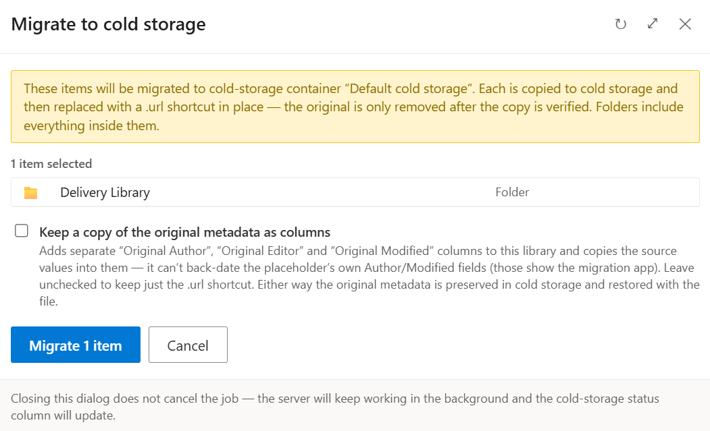
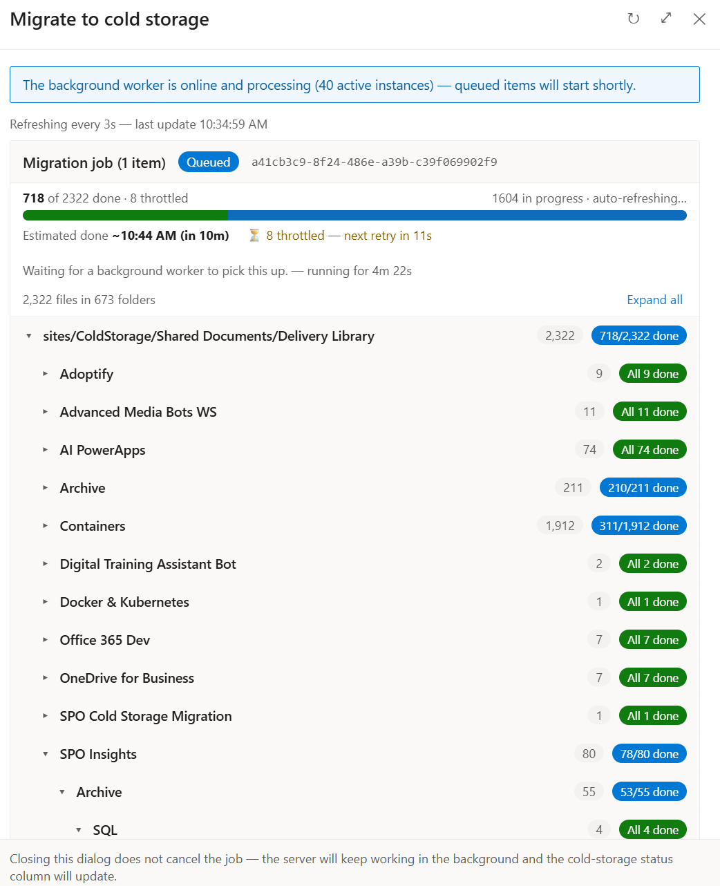
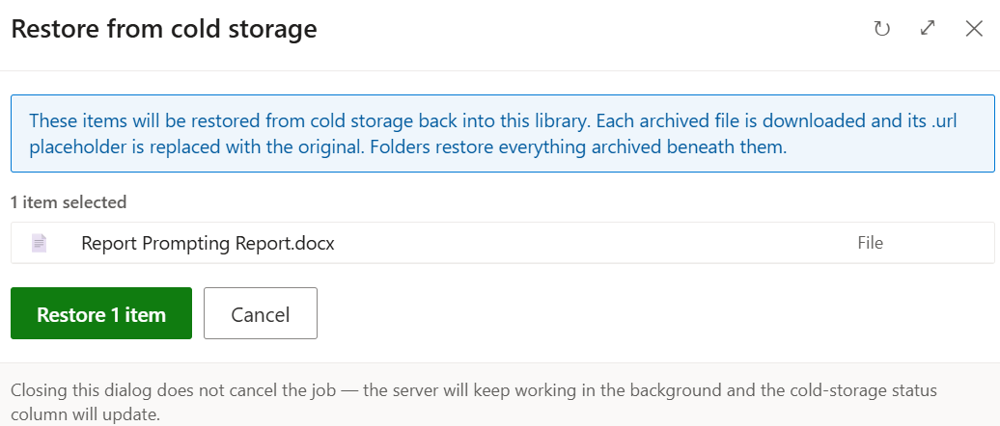
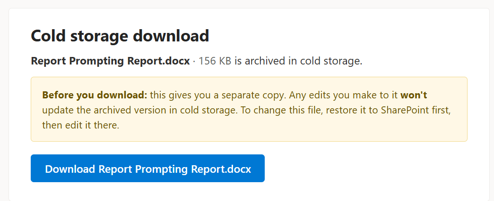
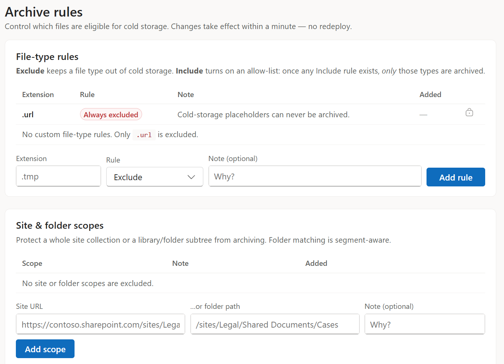

# SPO Cold Storage — User & Admin Guide

> A plain-English guide to **what this system does** for the people who use it.
> No setup, no code — just how it behaves and what you can do with it.
>
> For installation and infrastructure, see [`deploy/README.md`](deploy/README.md).
> For the full technical spec, see [`requirements.md`](requirements.md).

---

## 1. What it is, in one paragraph

SharePoint Online libraries fill up with files that nobody has opened in years, but
you still pay full price to store them. **SPO Cold Storage** moves those inactive
files out of SharePoint into cheaper Azure "cold" blob storage, and leaves behind a
small **`.url` placeholder** with the same name in the same place. The file looks
like it's still there, but the bytes now live in low-cost storage. When someone needs
the file again, it can be **restored** back to its original SharePoint location on
demand. Everything is tracked, logged, and reversible.

Think of it as an **automated archive-and-recall service for SharePoint documents**.

---

## 2. Who does what

| Role | Where they work | What they can do |
| --- | --- | --- |
| **Site-collection owner** | Inside SharePoint document libraries | Archive (migrate) files/folders to cold storage and restore them back. This is the only role that can trigger archive/restore actions from SharePoint. |
| **End user (reader)** | SharePoint + the web portal | See which files are archived, open a placeholder to download or request a file back, browse and search archived content (if granted storage access). |
| **Administrator** | The web portal + admin APIs | Configure what gets archived, watch and prioritise the processing queue, see cost savings, reconcile storage, force-restore in emergencies, manage exclusions, and review the audit trail. |

> **Golden rule of access:** cold-storage actions from SharePoint are offered **only
> to site-collection owners**. Access to the archived files themselves is controlled
> separately, per storage container, by Entra ID (Azure AD) user/group membership.

---

## 3. The one safety promise

**Your original file is never deleted until its copy in cold storage is proven good.**

Before the source file in SharePoint is removed, the system must have:

1. Successfully **copied** the file to Azure storage, **and**
2. **Validated** that copy — the stored file's length and checksum (MD5) match the original.

If anything fails at any point before that — the copy, the validation, the placeholder
creation — the operation stops and **the original stays exactly where it was**. You may
see a "failed" status, but you will not lose data.

---

## 4. Using it in SharePoint (site owners)

The system adds a small menu to your SharePoint document libraries and an extra
**status column**. You'll only see the archive/restore commands if you're a site owner.

### Archiving files ("Migrate to cold storage")

1. Select one or more files, or a folder, in the document library.
2. Choose **Migrate to cold storage** from the command menu.


*The command set adds **Migrate to cold storage**, **Restore from cold storage** and **Cold storage status** to the library toolbar and item menu — visible only to site owners.*

3. Confirm the action when prompted. You can optionally tick **Keep a copy of the
   original metadata as columns** to record the original author/editor/modified
   values on the library.


*The confirmation spells out the safety promise up front: each item is copied and **verified** before the original is removed, and folders include everything inside them.*

4. If more than one destination is available, **pick a container** (destinations can
   have different access rules — see §6).
5. The system queues the work. A progress dialog and the **status column** update
   automatically as each item moves through the lifecycle. You can close the dialog —
   the work continues in the background.


*Live progress with a real-time **ETA** and a streaming per-item activity log. The worker scales out (here, dozens of parallel instances) so large batches move quickly.*

For a big archive spanning many folders, the dialog breaks progress down by folder so
you can see exactly where things are. Throttling by SharePoint is handled
automatically — affected items wait and retry, and the count is shown.


*Per-folder progress for a large job (2,322 files across 673 folders). Throttled items retry automatically — nothing is lost, it just waits its turn.*

When it's done, each selected file is replaced by a **`.url` placeholder** of the same
name, in the same folder. Folders keep their structure, including nested content when
you archive recursively.

### Restoring files ("Restore from cold storage")

1. Select one or more `.url` placeholders (or a folder containing them).
2. Choose **Restore from cold storage** and confirm.


*Restore is the exact inverse: each archived file is downloaded and its `.url`
placeholder is swapped back for the original. Folders restore everything archived beneath them.*

3. The system copies the file's content back to its **original SharePoint location**
   and removes the placeholder once the restore is confirmed.


*A completed restore with its full activity log. The cold-storage copy is only deleted
**after** the restored file is verified present in SharePoint — the same never-lose-data
rule, in reverse.*

Restores can run on a **single item, a whole folder, or a batch**, with progress shown
as it goes.

### The status column

The extra column shows where each item is in its journey — for example *Queued*,
*In progress*, *Completed*, or a clear failure message if something needs attention.
It refreshes on its own, so you can watch a batch complete without reloading.

### "About to be archived" notices (grace period)

If automatic archiving is enabled, the system can **warn users before** a file is
archived and hold it for a grace period, giving people a chance to keep a file active
if they still need it. This avoids surprise archiving of something you're about to use.

---

## 5. Opening an archived file (everyone)

A `.url` placeholder is a normal, clickable item. Opening it takes the user to a
**cold-storage download page** for that file. If they have permission to the
container, they can download a copy of the archived file directly.


*Opening a placeholder lands here. The page is explicit that the download is a
**separate copy** — to *change* the file, restore it to SharePoint first, then edit it
there, so the archived version and the edited version never silently diverge.*

The file is streamed back through the web app (which holds the private connection to
storage), so downloads work even when the storage account blocks all public access.
If a user doesn't have access to the container the file lives in, they won't be able to
download it — access is deliberately enforced per container.

---

## 6. The web portal

Alongside the SharePoint experience there's a **web portal** for browsing, reporting,
accountability, and configuration. After signing in, users see four areas across the
top: **Cold Storage**, **Transfers & Logs**, **Savings**, and **Archive Rules**.

| Area | What it's for |
| --- | --- |
| **Cold Storage** | Browse the cold-storage containers and the files inside them, and download any archived file. You only see the containers you've been granted access to. |
| **Transfers & Logs** | Find any archive or restore across every site, filter it, and drill into its full per-file lifecycle timeline. The one-stop accountability console. |
| **Savings** | A cost & savings dashboard: how much storage has been reclaimed and the estimated net monthly saving. |
| **Archive Rules** | *(Admin)* Control which files are eligible — file-type rules and site/folder exclusion scopes. |

### Transfers & Logs


*Every step of every transfer is recorded — downloads, copies, verifications, source
deletions, placeholder writes, and automatic throttle retries — with timestamps and
severity, filterable and easy to find.*

### Savings


*Reclaimed storage and estimated net monthly saving. Figures are shown in a
configurable currency and, when a region is configured, use the **live Azure storage
price** for your account's region/tier (fetched from the public Azure Retail Prices API,
with a fallback to a configured price). Each price links to its source, and the live
figure links to the exact price query so the numbers can be verified.*

### Archive Rules (admin)


*Admins tune eligibility here — exclude (or allow-list) file types, and protect whole
site collections or library/folder subtrees from archiving. Changes take effect within
a minute, with no redeploy.*

> **Container access:** the portal calls Azure Storage on the user's behalf.
> Users must be granted read access (via Entra ID group/user) to a container to browse
> or download its files. Without it, they'll see an access-denied message for that
> container — this is by design.

---

## 7. What gets preserved

Archiving is designed to be **faithful and reversible**. When a file is archived and
later restored, the system preserves:

- **Original metadata** — the file's original author/created-by and editor/modified-by
  details are captured on the placeholder and reapplied on restore.
- **Permissions** — if the original file had unique (broken-inheritance) permissions,
  the placeholder and the restored file keep equivalent permissions.
- **Location & structure** — files return to their original library and folder path;
  folder hierarchies are preserved in cold storage.
- **Version history** *(optional)* — the full version history of a file can be preserved
  in cold storage and reconstructed on restore, not just the latest version.

---

## 8. What gets archived (eligibility)

Not everything is a good archive candidate, so the system applies **eligibility rules**
before it archives anything. Depending on configuration, files can be included or held
back based on:

- **Inactivity** — how long since the file was last modified **and last read/opened**.
  A file that's still being read regularly won't be archived just because it's old.
- **Size and file type** — minimum-size thresholds and file-type filters, so tiny or
  excluded types are skipped.
- **Exclusion lists** — specific sites, libraries, or folders can be **excluded** from
  archiving entirely.
- **Retention & legal hold** — content under a retention label or legal hold is
  **never archived**, so compliance obligations are respected.

---

## 9. Administrator capabilities

Administrators get extra tools, mostly in the web portal and via admin endpoints:

| Capability | What it does |
| --- | --- |
| **Migration targets** | Define which sites/libraries are scanned for scheduled archiving. |
| **Processing queue** | See what's queued and in-flight, **re-prioritise** urgent items, and **cancel** items that shouldn't run. |
| **Savings dashboard** | Track volume archived and estimated cost savings over time, in a configurable currency and (optionally) at live Azure prices for your region. |
| **Reconcile** | Detect and report **orphaned** cold-storage blobs (data in storage with no matching SharePoint placeholder) so storage stays clean and accurate. |
| **Force-restore (break-glass)** | Restore a file straight from a blob back into a library in emergencies, even when the normal placeholder-driven path isn't available. |
| **Bulk / folder restore** | Kick off large restores across a folder or a batch of items with progress tracking. |
| **Exclusions** | Add or remove the sites/libraries/folders that should be excluded from archiving. |
| **Audit log** | Review a record of who downloaded or restored cold-storage content, and when. |
| **Pre-archive review** | Evaluate which items *would* be archived and manage the "about to be archived" grace notices before anything moves. |

---

## 10. The lifecycle, in plain English

Every archive or restore request moves through a series of tracked states so that
SharePoint, the web portal, and the logs all agree on what's happening. You don't need
to memorise them — here's the simplified version:

**Archiving a file:**

```
Queued → Checking → Copying to cold storage → Verifying the copy
       → (source safe to remove) → Creating the .url placeholder → Done ✅
```

**Restoring a file:**

```
Queued → Copying back into SharePoint → Verifying the restore
       → Removing the .url placeholder → Done ✅
```

At every step there's a matching **failure state** (e.g. *Validation failed*,
*Copy failed*, *Placeholder failed*, *Restore failed*). A failure always leaves things
in a safe, recoverable position — the source file for an archive, or the placeholder
for a restore, stays put. Some states you might also see: *Completed with warning*
(succeeded, but something minor was logged), *Retry scheduled*, and *Cancelled*.

---

## 11. Common questions

**Will people notice their files are gone?**
Not really — a `.url` placeholder with the same name sits in the same place. It's clearly
marked (via the status column/badge), and opening it lets authorised users get the file.

**Is archiving reversible?**
Yes. Any archived file can be restored to its original SharePoint location on demand.

**Can I lose a file during archiving?**
No. The original is only deleted after the copy is made **and** verified. Any earlier
failure leaves the original untouched.

**Who can archive or restore?**
Only **site-collection owners** can trigger these actions from SharePoint. Access to the
archived files is controlled separately per storage container by Entra ID membership.

**What happens to files under legal hold or a retention label?**
They are excluded from archiving so compliance requirements are preserved.

**Does it keep old versions?**
It can — full version history can be preserved and restored when that option is enabled.

**A file shows a "failed" status. Did I lose it?**
No. Failures are safe by design. Check the **Logs** area (or ask an admin) for the
plain-language reason, then retry once the cause is resolved.

---

## 12. Glossary

| Term | Meaning |
| --- | --- |
| **Cold storage** | Low-cost Azure blob storage where archived file content is kept. |
| **`.url` placeholder** | The small stand-in file left in SharePoint that represents an archived file and links to its cold-storage copy. |
| **Migrate / Archive** | Move a file's content from SharePoint into cold storage and replace it with a placeholder. |
| **Restore** | Bring an archived file's content back into its original SharePoint location. |
| **Container** | A named area of storage with its own access rules; different containers can be shared with different people/groups. |
| **Eligibility** | The rules that decide whether a file should be archived (age, read activity, size, type, exclusions, holds). |
| **Reconcile** | An admin check that finds storage no longer matched by a SharePoint placeholder. |
| **Break-glass restore** | An emergency, admin-only restore directly from storage. |
| **Site-collection owner** | The SharePoint role permitted to trigger archive/restore actions. |
